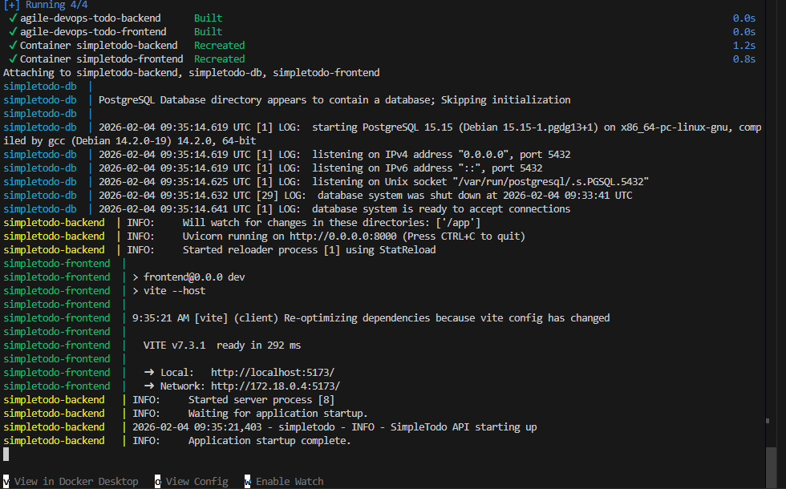
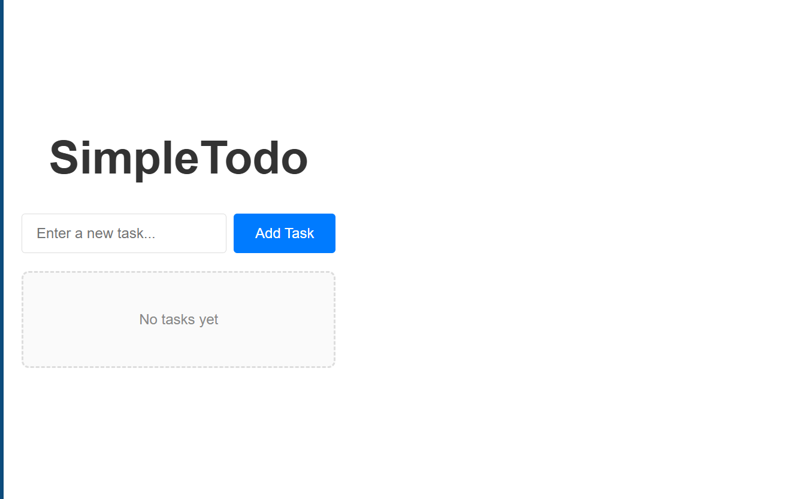

# SPRINT 1

**Sprint Goal:** Deliver a functional task management foundation that allows users to add and view tasks, establishing the core data flow and user interface patterns for future sprint work.

---

## Sprint Planning

### Team Capacity
- **Available Story Points:** 8-10 points
- **Rationale:** First sprint with no established velocity. Conservative estimate accounts for environment setup, learning curve, and process establishment.

### Selected User Stories

#### US-002: View Task List
**Story Points:** 2  
**Priority:** High

**User Story:**  
As a user, I want to see all my tasks in a list so that I can review what I need to do.

**Acceptance Criteria:**
- All added tasks display in a single list
- Each task shows its title clearly and is readable
- List updates immediately when tasks are added or modified
- Empty state displays message "No tasks yet" when list is empty
- Tasks remain visible across page refreshes
- List displays tasks in the order they were added

**Tasks:**
- Design database schema for task storage
- Create API endpoint to retrieve tasks
- Build user interface to display task list
- Implement empty state handling
- Test cross-browser compatibility
- Document API endpoint

---

#### US-001: Add New Task
**Story Points:** 3  
**Priority:** High

**User Story:**  
As a user, I want to add a new task with a title so that I can capture things I need to do.

**Acceptance Criteria:**
- User can enter a task title in an input field
- User can submit the task through a clear action (button or keyboard)
- Task appears in the task list immediately after submission
- Input field clears after successful submission
- Empty or whitespace-only titles are not accepted
- User receives visual confirmation that the task was added

**Tasks:**
- Create API endpoint to add new task
- Build input form in user interface
- Implement validation for empty submissions
- Add task to list after successful creation
- Provide user feedback on successful addition
- Test validation and error handling
- Document API endpoint

---

#### US-003: Mark Task as Complete
**Story Points:** 3  
**Priority:** High

**User Story:**  
As a user, I want to mark a task as complete so that I can track my progress and distinguish finished work from pending work.

**Acceptance Criteria:**
- User can mark any task as complete through a checkbox or button
- Completed tasks display with strikethrough text styling
- Completion status persists across page refreshes
- User can visually distinguish complete from incomplete tasks at a glance
- User can toggle a task back to incomplete if marked complete by mistake
- Completion action provides immediate visual feedback

**Tasks:**
- Update database schema to include completion status
- Create API endpoint to update task status
- Add completion toggle to user interface
- Implement visual distinction for completed tasks
- Enable toggle between complete and incomplete states
- Test status persistence
- Document API endpoint

---

### Sprint Commitment
**Total Committed Story Points:** 8

**Selection Justification:**
- Stories represent minimum viable workflow for task management
- Establishes foundation for all subsequent features
- Validates end-to-end architecture across all layers
- US-002 completed first as it establishes display mechanism
- US-001 builds on view capability
- US-003 extends interaction model

---

## Sprint Execution Log

### Early Sprint

**Completed Work:**
- Development environment initialized
- Project repository created with initial structure
- Docker configuration files created for frontend and backend services
- Database container configured
- Database schema designed and documented
- PostgreSQL database container configured
- FastAPI project structure established
- Database connection configuration completed
- Initial React components structure created

### Development Environment Setup

#### Docker Compose

*All three services (database, backend, frontend) running successfully*

**Services Running:**
- PostgreSQL Database on port 5432
- FastAPI Backend on port 8000
- React Frontend on port 5173

**US-002 Progress:**
- API endpoint for retrieving tasks created and tested
- Database migration tooling configured
- Task list display component created
- Empty state handling implemented
- Cross-browser testing completed (Chrome, Firefox, Safari, Edge)
- API endpoint documented
- **Status: Complete ✓**

**Blockers Encountered:**
- Docker networking between services required troubleshooting (resolved after 1 hour)

**Notes:**
- Database schema supports all Sprint 1 requirements
- API response format meets expectations
- First story completed successfully

**Burndown Update:** 6 story points remaining

---

### Mid-Sprint

**Completed Work:**
- API endpoint for adding tasks created
- Input validation logic implemented
- React form component built
- Form submission handling completed

**US-001 Progress:**
- Validation testing completed for all edge cases
- User feedback mechanisms implemented
- API endpoint documented
- **Status: Complete ✓**

**Mid-Sprint Assessment:**
- Progress: 5 of 8 points complete (62.5%)
- Sprint goal remains achievable
- Velocity tracking: On pace for full completion
- Process effectiveness: Daily rhythm working well
- No significant risks identified

**Notes:**
- Task creation flow is intuitive
- Quality of completed work is high
- Ready to begin completion feature

**Burndown Update:** 3 story points remaining

---

### Late Sprint

**Completed Work:**
- Database schema updated with completion status field
- Migration script created and tested
- API endpoint for updating task status created and tested
- Completion toggle UI component implemented
- Strikethrough styling applied to completed tasks
- Toggle functionality working in UI
- Visual feedback implemented
- Status persistence tested and verified

**US-003 Progress:**
- Cross-browser testing completed
- API endpoint documented
- **Status: Complete ✓**

**Notes:**
- Database migration completed smoothly
- All acceptance criteria met
- Sprint goal fully achieved

**Burndown Update:** 0 story points remaining

---

### Sprint End

**Final Status:**
- US-002: Complete ✓
- US-001: Complete ✓
- US-003: Complete ✓

**Sprint Achievements:**
- All three committed user stories completed
- Sprint goal fully achieved
- Baseline velocity established
- Process discipline maintained throughout sprint

---

## Sprint Review

### Completed Work

**US-002: View Task List** ✓  
All acceptance criteria met. Task list displays correctly with empty state handling. Cross-browser testing passed. Persistence verified.

**US-001: Add New Task** ✓  
All acceptance criteria met. Task creation functional with validation. User feedback working. Input clearing after submission verified.

**US-003: Mark Task as Complete** ✓  
All acceptance criteria met. Toggle functionality working. Visual styling applied. Status persistence verified across page refreshes.

**Screenshots:**
#### Empty State

*Application displays "No tasks yet" message when task list is empty*

### Sprint Metrics

- **Planned Story Points:** 8
- **Completed Story Points:** 8
- **Sprint Velocity:** 8 points
- **Completion Rate:** 100%

### Demonstration Summary

**Features Demonstrated:**
- Task list display with empty state and chronological ordering
- Task creation with validation and user feedback
- Completion toggle with visual styling and persistence
- End-to-end workflow: add task → view task → mark complete

### Technical Observations

**What Worked Well:**
- Architecture is solid and scalable
- Database schema supports future enhancements
- API patterns established for consistent development
- Docker containerization working smoothly
- Ready to add more complex features

**Areas for Improvement:**
- Some acceptance criteria could have been more specific about edge cases
- Initial database migration setup took longer than expected
- Burndown chart only updated when full stories completed, not at task level

### Sprint 2 Planning Notes

**Backlog for Sprint 2:**
- US-004: Delete Task (2 points)
- US-006: Filter Tasks by Status (3 points)
- US-005: Edit Task Title (5 points)

**Total Sprint 2 Commitment:** 10 story points

**Rationale:** Slightly higher commitment justified by established velocity and reduced setup overhead.

**Process Improvements Planned:**
- Add E2E testing with Playwright
- Standardize error handling with useError hook
- Add API response time logging
---

## Sprint Retrospective

### What Went Well

#### Process Execution
- All committed user stories completed successfully
- Sprint goal fully achieved (100% completion rate)
- Definition of Done applied consistently to all stories
- Separate commits for implementation and tests maintained discipline
- Feature branch workflow worked smoothly
- CI/CD pipeline caught issues early

#### Technical Execution
- Docker setup simplified environment management
- Database schema design supported all Sprint 1 requirements
- API patterns established consistency across endpoints
- React component structure remained clean and maintainable
- Test coverage comprehensive (backend pytest and frontend Vitest)
- Logging provided valuable debugging information

#### Documentation
- README kept current with each feature
- TESTING.md documented manual test results
- API endpoints clearly documented
- Commit messages were descriptive and followed convention

---

### What Could Be Improved

#### Process Observations

**Issue 1: Task granularity inconsistency**
Some tasks were very granular (separate commits for implementation and tests) while others combined multiple changes. This made it harder to track progress at the task level.

**Issue 2: No automated integration tests**
While unit tests exist, there are no end-to-end tests that verify the full user workflow from frontend through backend to database.

**Issue 3: Manual testing documentation is time-consuming**
Updating TESTING.md manually after each feature adds overhead and is easy to forget.

**Issue 4: No performance baseline**
We haven't measured API response times or frontend rendering performance. This could become important as the application grows.

**Issue 5: Error handling inconsistency**
Frontend error handling exists but isn't consistent across all components. Some errors display to users, others only log to console.

---

## Action Items for Sprint 2

Based on the retrospective, here are concrete improvements to implement:

### Action Item 1: Add End-to-End Tests
**Problem:** No automated tests verify complete user workflows  
**Solution:** Add Playwright or Cypress for E2E testing  
**Implementation:** Create E2E tests for core workflows (add task, complete task, view tasks)  
**Success Criteria:** At least one E2E test per user story in Sprint 2

---

### Action Item 2: Standardize Error Handling
**Problem:** Inconsistent error handling across frontend components  
**Solution:** Create reusable error handling hook or component  
**Implementation:** Add `useError` hook or `ErrorBoundary` component  
**Success Criteria:** All Sprint 2 features use consistent error handling pattern

---

### Action Item 4: Improve Task Breakdown Documentation
**Problem:** Task granularity inconsistent  
**Solution:** Document task breakdown in sprint planning with estimated time  
**Implementation:** Add task checklist to each user story branch  
**Success Criteria:** Each user story has clear task breakdown before implementation starts

---

## Sprint 2 Commitments

Based on Sprint 1 velocity (8 points) and identified improvements:

**Capacity:** 10 story points
- Sprint 1 velocity: 8 points
- Additional 2 points justified by:
  - No environment setup overhead
  - Established patterns and components
  - Improved process from retrospective

**Process Improvements to Apply:**
- Add E2E testing framework and tests
- Standardize error handling
- Add API performance logging

**Focus Areas:**
- Complete remaining CRUD operations (Delete, Edit)
- Add filtering functionality
- Maintain quality while increasing velocity
- Apply all retrospective improvements

---

## Sprint 2 Backlog

**Committed Stories:**
- US-004: Delete Task (2 points)
- US-006: Filter Tasks by Status (3 points)
- US-005: Edit Task Title (5 points)

**Total:** 10 story points

